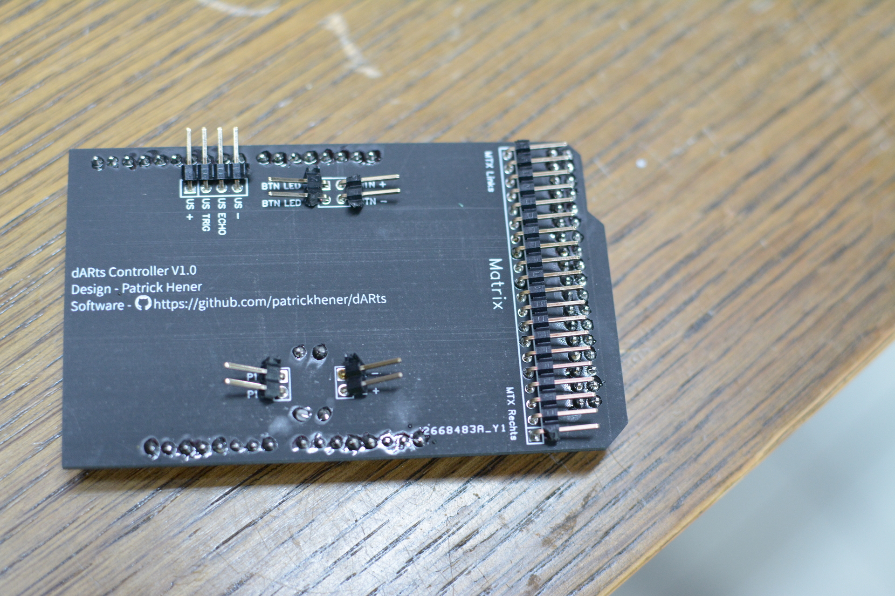
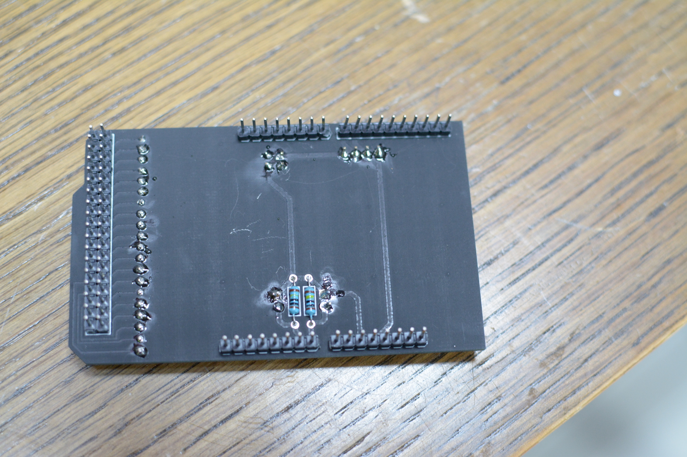
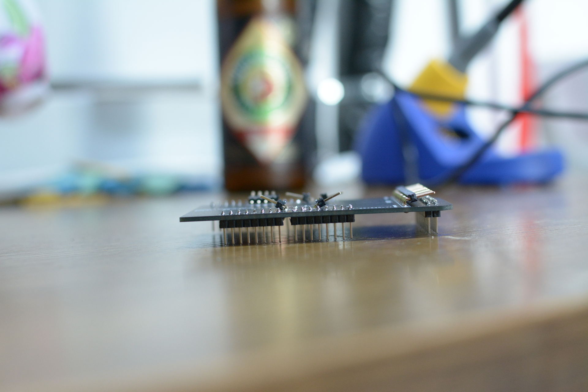
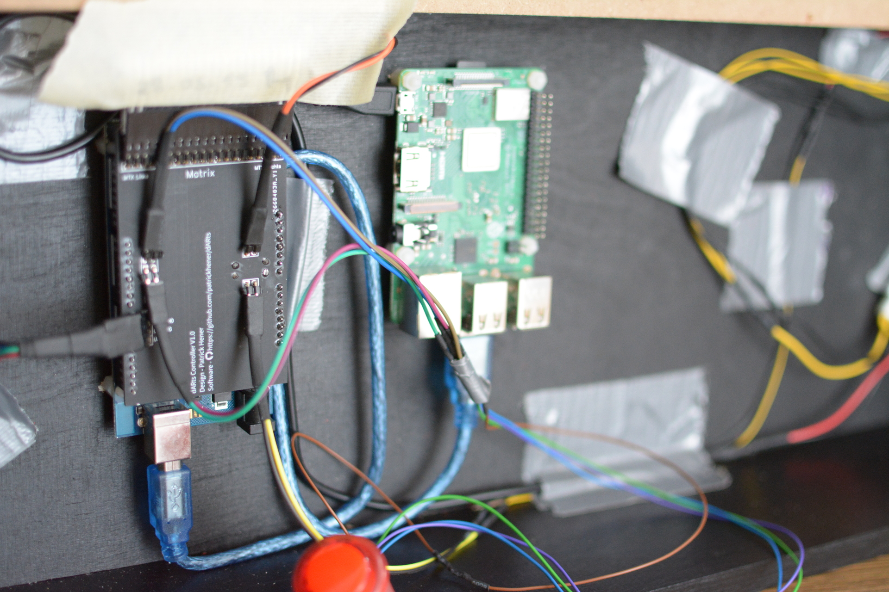

PCB Design
==========

In der Zip Datei sind alle Gerber Dateien enthalten, um eine Leiterplatine bestellen zu können.
Der Vorteil an der Leiterplatine ist, dass sie die notwendigen "Querverdrahtungen" schon als Routen auf der PCB hat.
Somit muss man nur noch Stiftleisten auflöten und kann die Platine dann auf den Arduino stecken.

Auf der Oberseite lötet man dann unterschiedliche Verbinder an und kann die Komponenten dann einfach aufstecken.

Changelog
=========

Version 1.0
-----------

Diese Version ist ein erster Versuch, wie praktisch diese Platine sein wird. In diesem Design ist die Platine so konfektioniert, dass an alle angedachten Verbindungen einfach Stiftleisten aufgelötet werden. Für die Matrixverbindung empfiehlt sich eine abgewinkelte Stiftleiste. Hat man alle Leisten aufgelötet kann man entweder mit Jumper-Kabeln mit weiblichem Ende arbeiten (für Knopf, Ultraschall, Piezos) oder vielleicht mit Schraubklemmen als Sockel.

Bilder
======

   Platine Oberseite

   Platine Rückseite

  Platine im Profil

  Platine eingebaut

