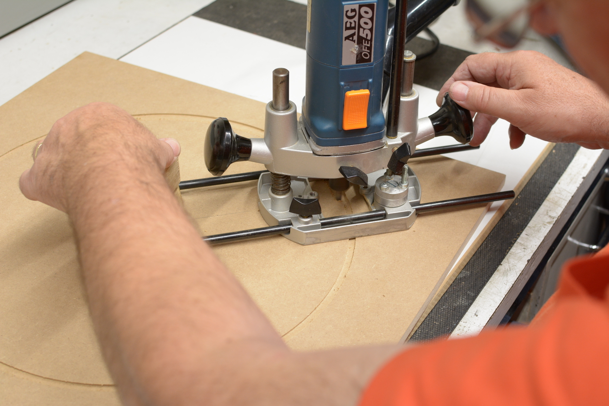

Bauanleitung
============

In der nachfolgenden Anleitung werden alle Schritte erläutert, die ich durchgeführt habe, um den Automaten als fertiges Produkt zu erhalten.

Schritt 1: Segmentbrett
-----------------------

Das Segmentbrett besteht aus MDF und ist 480mm auf 520mm und 12mm stark.

.. figure:: Bilder/01_Segmentbrett.JPG

  Brett für die Spinne (480mm x 520mm x 12mm MDF)

Auf diesem Brett muss zuerst die Mitte ermittelt werden und dann eine Bohrung für den Fräszirkel gesetzt werden.

.. figure:: Bilder/02_Mitte_anzeichnen.JPG

  Mitte für Fräszirkel

Zuerst wurde eine Probefräsung mit dem selbstgebauten Fräszirkel gemacht. Danach wird erst das Werkstück gefräst.

.. figure:: Bilder/03_Probefraesung_mit_DIY_Fraeszirkel.JPG

  Probefräsung auf Abfallplatte

Als erstes wird der äußerde Durchmesser der Spinne für 2mm versenkt (eingelassen) und anschließend wird der innere Durchmesser durchgestochen. Hierbei ist darauf zu achten, dass man die Fräsung für des Loch von oben bis zur halben Materialstärke macht, dann das Brett wendet und den Durchbruch von der anderen Seite fräst. Somit bekommt man saubere Kanten.

  Einlassen des äußeren Durchmessers (2mm)

.. figure:: Bilder/05_Spinne_eingelassen.JPG

  Die Spinne ist eingelassen

.. figure:: Bilder/06_Durchfraesen.JPG

  Durchfräsen von der anderen Seite

.. figure:: Bilder/08_Spinne_passt.JPG

  Die Spinne passt

Nun kann die Spinne durch das Loch gesteckt werden, ausgerichtet werden und mit Schrauben fixiert werden. Sie schließt plan ab und kann so nachher auf das Matrixbrett geschraubt werden.

Abschließend werden noch die Catchsegmente von der Hinterseite verschraubt und fertig ist die Konstruktion des Segmentbretts.

.. figure:: Bilder/09a_Catchringe_montieren.JPG
.. figure:: Bilder/09b_Catchringe_montieren.JPG

Schritt 2: Matrixbrett
----------------------

Das Matrixbrett besteht aus Sperrholz Multiplex und ist 520mm auf 520mm und 18mm stark.

.. figure:: Bilder/10_Matrixbrett.JPG

  Brett für die Matrix (520mm x 520mm x 18mm)

Durch Einmessen der Mitte und Zeichnen eines Kreuzes zur Markierung der Mitte ist es möglich die Matrix auszurichten. Die Matrix selbst ist trotz Trägerpapier etwas durchscheinend. Zur Orientierung kann man auch die Druckpunkte der Matrix verwenden. Wichtig ist, dass die Matrix perfekt mittig aufgebracht wird.

.. figure:: Bilder/11_Matrix_mittig_fixieren.JPG

  Matrix ist mittig auf dem Brett fixiert

Wichtig ist es die selbstklebende Matrix noch nicht aufzukleben. Zuerst fixieren wir sie mit Klebeband, setzen das Segmentbrett (mit ein paar eingelegten Segmenten) oben auf und testen, ob bei der aktuellen Positionierung alle Felder korrekt erkannt werden.

Ist das der Fall kann man die Matrix mit einem Edding oder Bleistift umranden, das Trägerpapier auf der Rückseite entfernen und dann die Matrix auf das Brett aufkleben und glatt streichen. Achtung, die Positionierung muss genau eingehalten werden!

Anschließend kann man das Segmentbrett wieder oben auflegen und mit 4 Schrauben auf das Matrixbrett fixieren.

.. figure:: Bilder/12_Einheit_zusammensetzen_testen.JPG

  Fertige Einheit

Es ist darauf zu achten, dass die Schraubenpositionen so gewählt werden, dass die Matrix nicht durchbohrt wird.

Schritt 3: Rückwand und Position der Einheit
--------------------------------------------

Die Rückwand besteht aus Sperrholz Multiplex und ist 750mm auf 600mm und 12mm stark.

Auf der Rückwand kann nun mit einem Rahmen die genaue Position der Einheit ermittelt werden. Unten muss Platz für die Technik bleiben und die Einheit sollte mittig sitzen.

.. figure:: Bilder/13_Einheit_auf-Rueckplatte_ausrichten.JPG

  Fertige Einheit sitzt passgenau auf der Rückwand

Dann bohrt man durch den Überstand der Matrixplatte und die Rückwand je 1 Loch in jeder Ecke. Dort habe ich bei diesem Automaten dann Gewindeschrauben eingeklebt um die fertige Einheit auf der Rückwand mit Gewindehülsen befestigen zu können.

  Einkleben der Schrauben von der Rückseite aus

.. figure:: Bilder/15_Schrauben_drin.JPG

  Schrauben sind fertig für die Einheit

.. figure:: Bilder/16_Mit_Huelsen_befestigen.JPG

  Einheit wird mit Hülsen auf der Rückwand befestigt

Schritt 4: Türe
---------------

Die Türe besteht aus Sperrholz Multiplex und ist 750mm auf 600mm und 12mm stark.

Die Türe bekommt den gleichen Rahmen eingezeichnet, wie die Rückwand, sodass die Umrisse der fertigen Einheit auch auf der Türe zu sehen sind. Nun kann man die Mitte des Rahmens und somit die Mitte der Scheibe ermitteln.

  Mittelbohrung für Fräszirkel in der Türe

Anschließend kann man mit dem Fräszirkel ein Loch in die Türe für die Scheibe machen. Hierbei sollte darauf geachtet werden, dass der Radius so gewählt wird, dass etwa 1,5mm Luft ist, um anschließend noch den Kantenschutz einbringen zu können.

.. figure:: Bilder/18_Tuerloch_fraesen.JPG

  Türloch wird eingefräst

Anschließend kann man die Türe für eine Passprobe auf das Werkstück legen.

.. figure:: Bilder/19_Fertige_tuere_mit_Kantenschutz.JPG

  Türe passt mit Kantenschutz

Abschließend wird noch ein Loch für den Knopf eingelassen.

.. figure:: Bilder/21_Knopf_in_Tuere_einlassen.JPG

  Knopf in Türe

Schritt 5: Montage Seitenwände
------------------------------

Die Seitenwände bestehen aus Sperrholz Multiplex und sind 750mm auf 200mm und 12mm stark.

Die Seitenwände werden auf die Stirnseiten der Rückplatte befestigt. Zuerst die Seiten dann das Oberteil. Unten wird vorerst keine Platte befestigt.

Hierbei ist es wichtig alle Schraubenlöche vorzubohren. Die Köpfe der Schrauben können auch versenkt werden. So sieht der fertige Automat nachher noch besser aus.

.. figure:: Bilder/20_Seitenteile_befestigen.JPG

  Seitenteil wird befestigt

Schritt 6: Streichen
--------------------

Als nächsten Schritt habe ich die Teile gestrichen. Dazu verwende ich einen matten, schwarzen Lack, den ich mit einer Lackierwalze (glatt und aus Schaumstoff) aufgebracht habe. Nach einer Schicht kommt noch leicht die Maserung des Holz durch, was ich ziemlich schön finde. Für ein deckendes Ergebnis muss man das Holz eher zweimal streichen. Man sollte hierbei unbedingt die Trocknungszeit beachten.

.. figure:: Bilder/22a_Streichen.JPG

  Türe schwarz gestrichen

  Kasten schwarz gestrichen

Schritt 7: Trocknungszeit nutzen, Einheit bestücken
---------------------------------------------------

Während der Kasten und die Türe trocknen kann man die Einheit bestücken.

.. figure:: Bilder/23_Bestueckung_Segmente.JPG

  Fertig bestückte Spinne

Dazu muss man die Einheit zuvor erneut zerlegen und dann die Segmente korrekt einsetzen. Ich habe dann noch zwei Piezo Sensoren hinter dem Catchring auf der Rückseite des Segmentbretts mit Klebeband fixiert und die Kabelzuleitungen seitlich heraushängen lassen.

.. figure:: Bilder/24_Piezo_Sensor.JPG

  Kabelzuleitung Piezosensor

Schritt 8: Technik - Stecker, Kabel, Arduino, Pi
------------------------------------------------

Ich habe mich entschieden Jumperkabel zu nehmen und eine Seite mit Schrumpfschlauch zu Steckern zu schrumpfen. Diese Stecker können später einfach auf der individuellen Platine aufgesteckt werden.

.. figure:: Bilder/25_Stecker.JPG

  Jumperkabel wurden zu Steckern gefertigt

Die Technik habe ich an der richtigen Stelle angezeichnet. Dann habe ich von hinten Abstandshalter verschraubt, auf der die Technik fixiert werden kann. So sitzen Arduino und Pi anschließend sicher im Gehäuse.

.. figure:: Bilder/26_Technik.JPG

  Arduino und PI sitzen sicher im Gehäuse

Abschließend kann auch die Einheit wieder eingesetzt werden, sodass man die Kabelführung besser planen kann.

.. figure:: Bilder/27_Einheit_eingebaut.JPG

  Die Einheit ist wieder auf der Rückplatte befestigt

Schritt 9: Kabel verlegen
-------------------------

Jetzt können die Kabel verlegt werden und die Stecker in Position gebracht werden.

Hierbei habe ich den Ultraschallsensor von oben angebracht (durchgebohrt) und die Kabel über die Oberseite unsichtbar verlegt.
Außerdem habe ich die Kabelstrecken immer wieder mit Klebeband vor dem Verrutschen fixiert.

.. figure:: Bilder/28a_Kabel.JPG

.. figure:: Bilder/28b_Kabel.JPG

.. figure:: Bilder/28c_Kabel.JPG

.. figure:: Bilder/28d_Ultraschall.JPG

  Ultraschall Sensor ist in Position

Schritt 10: Türe inklusive Verriegelung
---------------------------------------

In das Loch in der Türe wird der Kantenschutz mit einem Tacker eingebracht. Ich musste dazu noch die Führungsnut des Kantenschutzes mit einem Messer abschneiden.

Dann kann erneut geprüft werden, ob die Türe passt. Durch die Lackierung und das zu genaue Arbeiten war ich gezwungen die Türe nochmals an den Seiten und unten abzuschleifen, damit sie passt.

.. figure:: Bilder/29_Tuere_passt.JPG

Nun habe ich von oben und einmal seitlich ein kleines Loch gebohrt, in das ein Nagel gesteckt werden kann. Dann wird die Türe vor dem Verrutschen gesichert. Im vierten Eck wird das Schloss eingebaut und verriegelt die Türe. Außerdem dient es zum Ausziehen der Türe für Wartungsarbeiten. Hier muss genau gearbeitet werden.

.. figure:: Bilder/30_Nagel_in_der_Decke.JPG

  Nagel von Oben durch die Decke in die Türe

.. figure:: Bilder/31_Schloss_in_der_Ecke.JPG

  Schloss unten links in der Türe

Schritt 11: Blenden herstellen und leimen
-----------------------------------------

Die Stirnblenden habe ich aus Winkelholz geschnitten. Es hat die Maße 30mm x 30mm und ist 5mm dick. Ich habe die Blenden ebenfalls schwarz gestrichen und auf Gehrung geschnitten und eingepasst.

Anschließend werden die Leisten an die Seiten geleimt. Unter den Blenden werden später die LEDs angebracht.

.. figure:: Bilder/32_Blenden_leimen.JPG

  Blenden sind geleimt und mit Schraubzwingen fixiert

.. figure:: Bilder/33_Blenden_fertig.JPG

  Die Blenden sind fertig

Schritt 12: Netzteil und LEDs
-----------------------------

Die LEDs für unter die Blenden habe ich vorab abgelängt und mit ausreichend langen Kabeln versehen.

Die LEDs habe ich dann unter den Blenden aufgeklebt. Ich habe zusätzlich Holzleim verwendet, da mit solche LED Bänder meist abgefallen sind. Ich habe die LEDs außerdem vorübergehend mit Klebeband fixiert.

.. figure:: Bilder/34_LEDs_unter_Leisten_geklebt.JPG

  Die LEDs kleben unter den Blenden

Die gelben und schwarzen Kabel am rechten Kastenrand sind die LED Kabel, die ich ebenfalls über den Deckel verlegt, im Gehäuse zusammengeführt und dann zum Netzteil nach unten verlegt habe.

Das Netzteil hat einen 12V und einen 5V Ausgang und liefert ausreichend Strom für die Technik und die LEDs.

.. figure:: Bilder/35_Netzteil.JPG

  Netzteil ist im Kasten fixiert

Das Stromkabel wird durch ein Loch im Boden nach unten herausgeführt und kann bei Bedarf auch abgenommen und wieder eingesteckt werden.

Am Netzteil sind die LEDs (Gelb/Schwarz) und ein Micro-USB Stecker (Rot/Schwarz) für den Pi angelötet.

Schritt 13: Zahlen aufkleben
----------------------------

Zuerst werden alle Zahlen, die benötigt werden ausgeschnitten und ausgelegt. Hier gilt es besonders oft zu kontrollieren, ob die Reihenfolge stimmt.

.. figure:: Bilder/36_Zahlen_auslegen.JPG

Dann habe ich eine Schablone gefertigt. Diese wird mittig im Bulls Eye angebracht mithilfe eines Pfeils und zeigt die Mitte des Feldes an. So können die Zahlen besser ausgerichtet werden.

.. figure:: Bilder/37_Schablone_in_aktion.JPG

Nun ist Geduld und ein gutes Auge gefragt. Abschließend hat man es geschafft und alle Zahlen sind aufgeklebt.

.. figure:: Bilder/38_Fast_geschafft.JPG

  Fast geschafft!!

.. figure:: Bilder/39_Zahlen_fertig.JPG

  Alle Zahlen sind aufgeklebt und LEDs funktionieren

Schritt 14: Platine löten und einbauen
--------------------------------------

Die Platine habe ich selbst designed und dann online bestellt. Man muss praktisch nur noch Stiftleisten nach unten gerichtet auflöten für die Steckverbindung zum Arduino.

  Platine ungelötet Vorderseite

  Platine ungelötet Rückseite

Oben lötet man abgewinkelte Steckleisten auf, für die Steckerverbindungen zu Sensoren, Matrix und Knopf. Außerdem muss man noch zwei 1 MOhm Widerstände für die Piezos einlöten.

Dann kann alles zusammengesteckt werden und die Funktion getestet werden.

Schritt 15: Abschlusstests
--------------------------

Für den Abschlusstest verwende ich mein Dart-O-Mat 3000 Scoreboard und ein Tablet als Anzeige. Das Scoreboard läuft mit auf dem Pi. Ich habe den Pi so konfiguriert, dass er ein eigenes WLAN ausstrahlt, mit dem man das Tablet zur Anzeige verbinden kann.

Nun müssen alle Funktionen getestet werden (Fehlwurf, Wurferkennung, Knopf, Ultraschallsensor, ...)

Abschließende Bilder
--------------------

